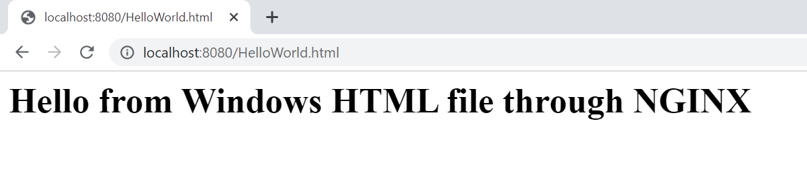
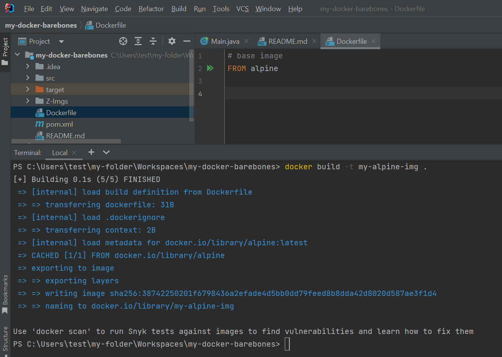
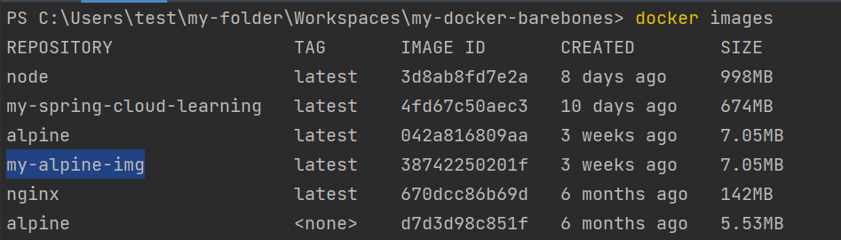
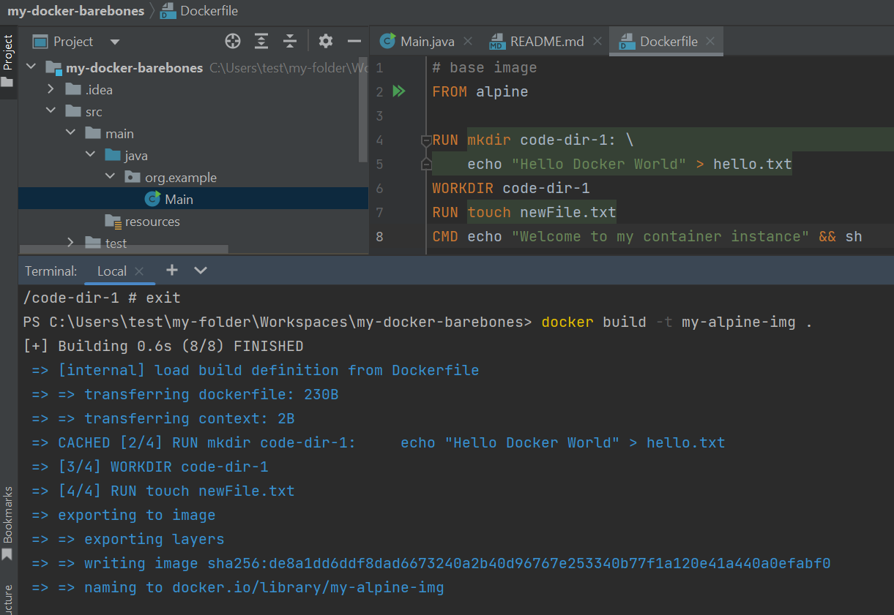

# install docker (docker desktop) on the system & run the commands.

# Docker Containerizes a Process.
Docker uses Linux containerization features.

C:\Users\test>docker pull alpine
                Using default tag: latest
                latest: Pulling from library/alpine
                8921db27df28: Pull complete
                Digest: sha256:f271e74b17ced29b915d351685fd4644785c6d1559dd1f2d4189a5e851ef753a
                Status: Downloaded newer image for alpine:latest
                docker.io/library/alpine:latest

-it (--interactive --terminal), sh (shell)

docker run cmd extracts contents of an image(zip/tar file) to create a container.

C:\Users\test>docker run -it alpine sh
    / # pwd
    /
    / # ls -ltr
        total 56
        drwxr-xr-x   12 root     root          4096 Jan  9 12:46 var
        drwxr-xr-x    7 root     root          4096 Jan  9 12:46 usr
        drwxrwxrwt    2 root     root          4096 Jan  9 12:46 tmp
        drwxr-xr-x    2 root     root          4096 Jan  9 12:46 srv
        drwxr-xr-x    2 root     root          4096 Jan  9 12:46 run
        drwxr-xr-x    2 root     root          4096 Jan  9 12:46 opt
        drwxr-xr-x    2 root     root          4096 Jan  9 12:46 mnt
        drwxr-xr-x    5 root     root          4096 Jan  9 12:46 media
        drwxr-xr-x    7 root     root          4096 Jan  9 12:46 lib
        drwxr-xr-x    2 root     root          4096 Jan  9 12:46 home
        drwxr-xr-x    2 root     root          4096 Jan  9 12:46 sbin
        drwxr-xr-x    2 root     root          4096 Jan  9 12:46 bin
        dr-xr-xr-x   11 root     root             0 Feb  1 21:20 sys
        dr-xr-xr-x  300 root     root             0 Feb  1 21:20 proc
        drwxr-xr-x    1 root     root          4096 Feb  1 21:20 etc
        drwxr-xr-x    5 root     root           360 Feb  1 21:20 dev
        drwx------    1 root     root          4096 Feb  1 21:20 root
    / #
    / # exit
C:\Users\test>

C:\Users\test>docker ps -a
    CONTAINER ID   IMAGE    COMMAND     CREATED             STATUS                     PORTS    NAMES
    131420bf8373   alpine   "ls"        10 minutes ago      Exited (0) 10 minutes ago           compassionate_shtern
    f1138f4d9edd   alpine   "alpine"    10 minutes ago      Created                             silly_wescoff
    91a9b7b1c2f3   alpine   "sh"        11 minutes ago      Up 11 minutes                       clever_almeida
    fba1ec656ab6   alpine   "sh"        13 minutes ago      Exited (0) 11 minutes ago        

C:\Users\test>docker run -it openjdk sh
    sh-4.4# java --version
        openjdk 18.0.1.1 2022-04-22
        OpenJDK Runtime Environment (build 18.0.1.1+2-6)
        OpenJDK 64-Bit Server VM (build 18.0.1.1+2-6, mixed mode, sharing)
    sh-4.4# jshell
        Feb 02, 2023 3:06:51 AM java.util.prefs.FileSystemPreferences$1 run
        INFO: Created user preferences directory.
        |  Welcome to JShell -- Version 18.0.1.1
        |  For an introduction type: /help intro
        
        jshell> System.out.println("Hello Docker");
        Hello Docker
        
        jshell> /exit
        |  Goodbye
    sh-4.4# exit
    exit

C:\Users\test>
C:\Users\test>docker ps
    CONTAINER ID   IMAGE     COMMAND   CREATED          STATUS          PORTS     NAMES
    44b72e8afcf1   openjdk   "sh"      19 seconds ago   Up 18 seconds             lucid_fermat
    

# Connecting to a running container using exec cmd.
C:\Users\test>docker exec -it 44b72e8afcf1 sh    
    sh-4.4# jshell
    |  Welcome to JShell -- Version 18.0.1.1
    |  For an introduction type: /help intro
    
    jshell> System.out.println("Connecting to a running openjdk container");
    Connecting to a running openjdk container
    
    jshell>

# Running mysql container & connecting to it to do SQL operations.
C:\Users\test>docker run -it -d -e MYSQL_ROOT_PASSWORD=secret mysql
    aef2727e6fcf019b0605b7a1cf8d23add936e768fd1f6e3cd5835ad7c68f768c

C:\Users\test>docker ps
    CONTAINER ID   IMAGE     COMMAND                  CREATED          STATUS          PORTS                 NAMES
    aef2727e6fcf   mysql     "docker-entrypoint.s…"   11 seconds ago   Up 11 seconds   3306/tcp, 33060/tcp   jovial_keller

C:\Users\test>docker exec -it jovial_keller mysql -p
    Enter password:
    Welcome to the MySQL monitor.  Commands end with ; or \g.
    Your MySQL connection id is 8
    Server version: 8.0.29 MySQL Community Server - GPL
    
    Copyright (c) 2000, 2022, Oracle and/or its affiliates.
    
    Oracle is a registered trademark of Oracle Corporation and/or its
    affiliates. Other names may be trademarks of their respective
    owners.
    
    Type 'help;' or '\h' for help. Type '\c' to clear the current input statement.
    
    mysql> show databases;
        +--------------------+
        | Database           |
        +--------------------+
        | information_schema |
        | mysql              |
        | performance_schema |
        | sys                |
        +--------------------+
        4 rows in set (0.00 sec)
    
    mysql>

# passing external file system reference to a jdk container using -v(volume) option.
PS C:\Users\test> docker run --rm -it -v ${PWD}:/my-folder/ZZ-Temp openjdk sh
    sh-4.4# pwd
        /
    sh-4.4# ls
        bin  boot  dev  etc  home  lib  lib64  media  mnt  my-folder  opt  proc  root  run  sbin  srv  sys  tmp  usr  var
    sh-4.4# cd my-folder/ZZ-Temp/
    sh-4.4# pwd
        /my-folder/ZZ-Temp    
    sh-4.4# ls
        HelloWorld.java
    sh-4.4# javac HelloWorld.java
    sh-4.4# java HelloWorld
        Hello Docker
    sh-4.4#

# Starting nginx web server & mapping host port to container port using -p(port) option.
PS C:\Users\test> docker run -p 8080:80 nginx
    /docker-entrypoint.sh: /docker-entrypoint.d/ is not empty, will attempt to perform configuration
    /docker-entrypoint.sh: Looking for shell scripts in /docker-entrypoint.d/
    /docker-entrypoint.sh: Launching /docker-entrypoint.d/10-listen-on-ipv6-by-default.sh
    10-listen-on-ipv6-by-default.sh: info: Getting the checksum of /etc/nginx/conf.d/default.conf
    10-listen-on-ipv6-by-default.sh: info: Enabled listen on IPv6 in /etc/nginx/conf.d/default.conf
    /docker-entrypoint.sh: Launching /docker-entrypoint.d/20-envsubst-on-templates.sh
    /docker-entrypoint.sh: Launching /docker-entrypoint.d/30-tune-worker-processes.sh
    /docker-entrypoint.sh: Configuration complete; ready for start up
    2023/02/02 19:29:03 [notice] 1#1: using the "epoll" event method
    2023/02/02 19:29:03 [notice] 1#1: nginx/1.23.1
    2023/02/02 19:29:03 [notice] 1#1: built by gcc 10.2.1 20210110 (Debian 10.2.1-6)
    2023/02/02 19:29:03 [notice] 1#1: OS: Linux 5.10.16.3-microsoft-standard-WSL2
    2023/02/02 19:29:03 [notice] 1#1: getrlimit(RLIMIT_NOFILE): 1048576:1048576
    2023/02/02 19:29:03 [notice] 1#1: start worker processes
    2023/02/02 19:29:03 [notice] 1#1: start worker process 31
    2023/02/02 19:29:03 [notice] 1#1: start worker process 32

    172.17.0.1 - - [02/Feb/2023:19:29:22 +0000] "GET / HTTP/1.1" 200 615 "-" "Mozilla/5.0 (Windows NT 10.0; Win64; x64) AppleWebKit/537.36 (KHTML, like Gecko) Chrome/109.0.0.0 Safari/537.36" "-"
    2023/02/02 19:29:23 [error] 31#31: *1 open() "/usr/share/nginx/html/favicon.ico" failed (2: No such file or directory), client: 172.17.0.1, server: localhost, request: "GET /favicon.ico HTTP/1.1", host: "localhost:8080", referrer: "http://localhost:8080/"
    172.17.0.1 - - [02/Feb/2023:19:29:23 +0000] "GET /favicon.ico HTTP/1.1" 404 555 "http://localhost:8080/" "Mozilla/5.0 (Windows NT 10.0; Win64; x64) AppleWebKit/537.36 (KHTML, like Gecko) Chrome/109.0.0.0 Safari/537.36" "-"

PS C:\Users\test> cd .\my-folder\ZZ-Temp\
PS C:\Users\test\my-folder\ZZ-Temp> ls

    Directory: C:\Users\test\my-folder\ZZ-Temp

Mode                 LastWriteTime         Length Name
----                 -------------         ------ ----
-a----          2/2/2023  11:21 AM            426 HelloWorld.class
-a----          2/2/2023   2:34 PM             53 HelloWorld.html
-a----          2/2/2023  11:10 AM            122 HelloWorld.java

PS C:\Users\test\my-folder\ZZ-Temp> docker run -p 8080:80 -v ${PWD}:/usr/share/nginx/html nginx
    /docker-entrypoint.sh: /docker-entrypoint.d/ is not empty, will attempt to perform configuration
    /docker-entrypoint.sh: Looking for shell scripts in /docker-entrypoint.d/
    /docker-entrypoint.sh: Launching /docker-entrypoint.d/10-listen-on-ipv6-by-default.sh
    10-listen-on-ipv6-by-default.sh: info: Getting the checksum of /etc/nginx/conf.d/default.conf
    10-listen-on-ipv6-by-default.sh: info: Enabled listen on IPv6 in /etc/nginx/conf.d/default.conf
    /docker-entrypoint.sh: Launching /docker-entrypoint.d/20-envsubst-on-templates.sh
    /docker-entrypoint.sh: Launching /docker-entrypoint.d/30-tune-worker-processes.sh
    /docker-entrypoint.sh: Configuration complete; ready for start up
    2023/02/02 19:40:48 [notice] 1#1: using the "epoll" event method
    2023/02/02 19:40:48 [notice] 1#1: nginx/1.23.1
    2023/02/02 19:40:48 [notice] 1#1: built by gcc 10.2.1 20210110 (Debian 10.2.1-6)
    2023/02/02 19:40:48 [notice] 1#1: OS: Linux 5.10.16.3-microsoft-standard-WSL2
    2023/02/02 19:40:48 [notice] 1#1: getrlimit(RLIMIT_NOFILE): 1048576:1048576
    2023/02/02 19:40:48 [notice] 1#1: start worker processes
    2023/02/02 19:40:48 [notice] 1#1: start worker process 31
    
    172.17.0.1 - - [02/Feb/2023:19:40:52 +0000] "GET /HelloWorld.html HTTP/1.1" 200 53 "-" "Mozilla/5.0 (Windows NT 10.0; Win64; x64) AppleWebKit/537.36 (KHTML, like Gecko) Chrome/109.0.0.0 Safari/537.36" "-"

# Create a Docker image using the Dockerfile & the build cmd. -t (tag name) & "." is the current directory where to find the Dockedfile. 

# Dockerfile commands:

